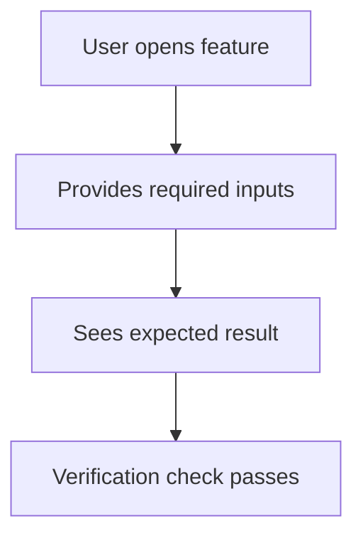

# Sprint plan reference

## Approval-package checklist

Before presenting plan-lock, `.opsboard/approvals/<sprint-id>/` must contain:

| Artifact | Required when |
| --- | --- |
| `README.md` | Always |
| `capabilities.md` | Always |
| `capabilities/<slug>.md` | Every in-scope capability |
| `flows/<slug>.md` | Every capability (user flow; admin flow if any) |
| `mocks/<slug>/` | UI-facing capabilities (nabapro or HTML) |
| `videos/<slug>/` | UI-facing capabilities (mock interaction video) |
| `n/a` justification in Function Spec | Backend-only capabilities |

Human decision surface after the package is complete:

1. **Approve plan-lock** — comment the required phrase and close the gate
2. **Steer** — list concrete deltas; agent revises the package and re-presents

Chat-only go-ahead is never durable approval.

## Function Spec template

Write one file per capability at `capabilities/<slug>.md`:

```markdown
# Capability: <name>

## Purpose
<one line>

## Activation
default-on | feature-flag | admin-flow | config
<details of how it is enabled>

## Actors
end-user | admin | system

## User flow
Steps:
1. ...
Schematic: ../flows/<slug>.md

## Admin flow
none | Steps: ...
Schematic: ../flows/<slug>.md (admin diagram)

## Inputs
- <what the user/admin must provide>

## Outputs
- <what they see or get>

## Verification
- [ ] <observable human check>
- [ ] ...

## Non-goals
- ...

## Risks
- surprise / irreversible / security notes

## Evidence
- Mocks: ../mocks/<slug>/
- Video: ../videos/<slug>/  (or n/a: <reason>)
- Post-build demo/acceptance: (filled later)

## Approval
- Gate: plan-lock (and design-ux if separate)
- Required human comment: `approve plan-lock for <sprint-id>: <slug list>`
```

`capabilities.md` is a table: slug, purpose, UI? (yes/no), admin? (yes/no), status (draft/ready).

## Flow schematics

In `flows/<slug>.md` use mermaid. Prefer separate diagrams for user vs admin:



## Mock screens and video

- **Screens:** prefer the `nabapro` skill; store PNG (and optional HTML) under `mocks/<slug>/`. If nabapro is unavailable, ship a self-contained HTML prototype and note the fallback in the Function Spec.
- **Video (UI-facing required):** prefer `narrated-video-production` with its narration lock nested in the package (`videos/<slug>/`). Tiny flows may use a short silent recording of the HTML prototype if labeled `silent-prototype`.
- Do not treat incomplete mocks or missing UI video as plan-lock-ready.

## Gate taxonomy

| Gate | When | Package / evidence |
| --- | --- | --- |
| `plan-lock` | Before any issues, worktrees, or implementation commits | Full approval package |
| `design-ux` | UI design contested or large; otherwise fold into plan-lock | Schematics + mocks + mock video approved |
| `review` | After implementation evidence | Demo/acceptance mapped to verification matrix |
| `deployment` | Before any live mutation | CD gate template (revision, ns, canary, rollback) |
| `policy` / `security` / `schema` / `irreversible` | Sensitive or irreversible change | Explicit risk + required authority in gate body |
| `human-decision` | Mid-flight choice (label `opsboard:human-decision`) | `approvals/<sprint-id>/decisions/<id>/` option package |

Gates are separate git-bug issues labeled `opsboard:gate` (except mid-flight `opsboard:human-decision`). Sprint markdown must list gate IDs after creation.

## Sprint proposal skeleton

`.opsboard/sprints/<sprint-id>.md`:

```markdown
# Sprint <id>: <title>

## Goal
## In scope / Out of scope
## Approval package
Path: `.opsboard/approvals/<sprint-id>/`
## Capabilities
(link capabilities.md)
## Acceptance criteria
(mapped to Function Spec verification)
## Dependencies
## Proposed tasks
(one owner, non-overlapping file scopes; created only after plan-lock)
## Gates
- plan-lock: (pending until package approved)
- review: ...
- deployment: ... (if needed)
## Demos
```

## After plan-lock closes

1. Create sprint issue (`opsboard:sprint`), task issues, gate issues.
2. Record issue IDs in the sprint file and package README.
3. Push `refs/bugs/*` and `refs/identities/*`.
4. Only then start worktrees via `opsboard-worktree-task`.
